## Что можно делать в приложении

### Главная страница
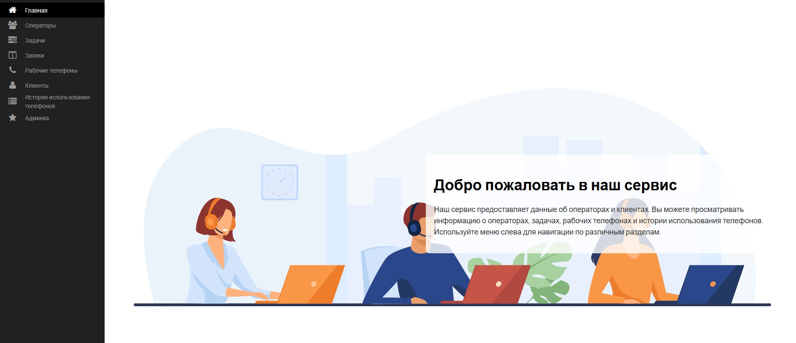

### Список операторов
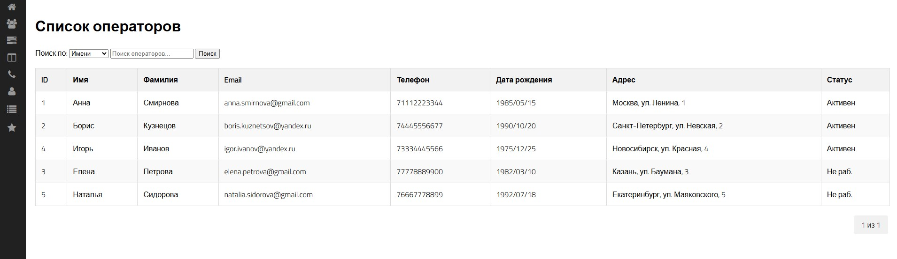

Отображает актуальную информацию по операторам. Статус: Активен означает что оператор работает.

### Список актуальных клиентов
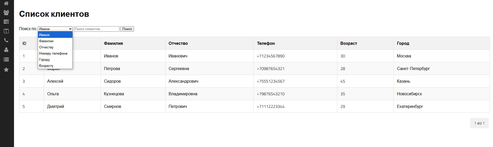

### Список заявок
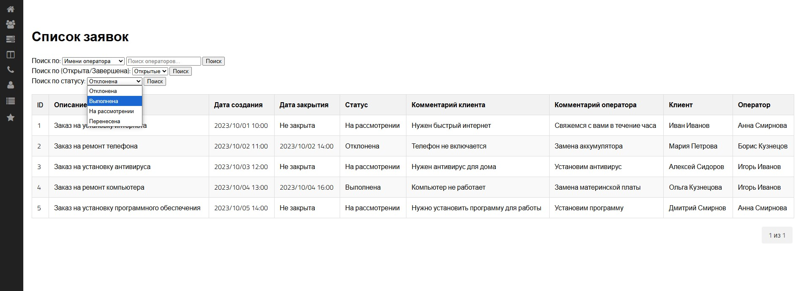

Актуальные заявки, с указанием клиента и оператора кто и на кого создал заявку

### Список задач
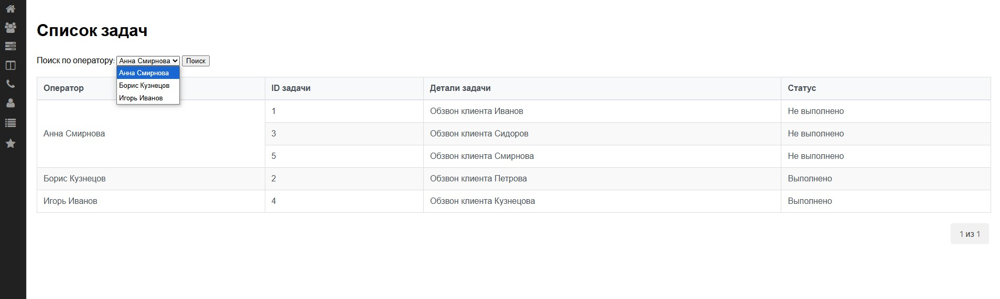
 Задачи для операторов, то что необходимо выполнить оператору

### История использования телефонов
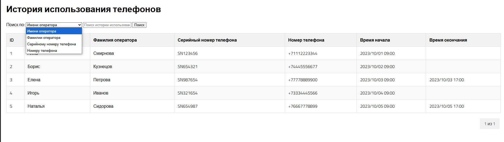
Тут отображается когда и кем был использован телефон, конечная дата устанавливается в момент отвязки телефона от оператора, или когда происходит смена телефона у оператора.
При увольнении телефон автоматически отвязывается от оператора.

### Добавление оператора
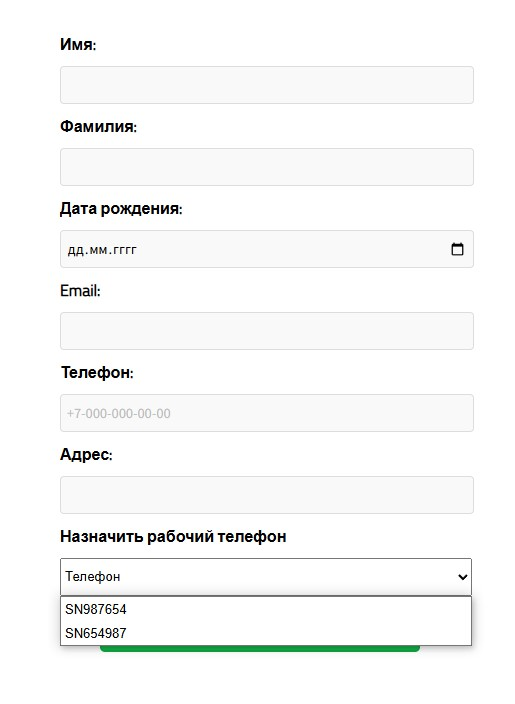

Форма для добавления оператора, ввод данных и назначение телефона для работы из списка телефонов

### Форма изменения и удаления
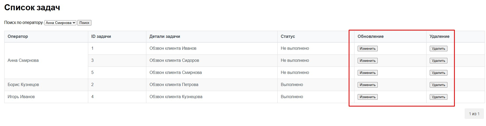

Когда нужно кого-то изменить или удалить, то нужно зайти в админ панель и выполнить необходимые действия.
В таком случае в таблицах открывается дополнительное меню изменения и удаления

### Предупреждение об удалении
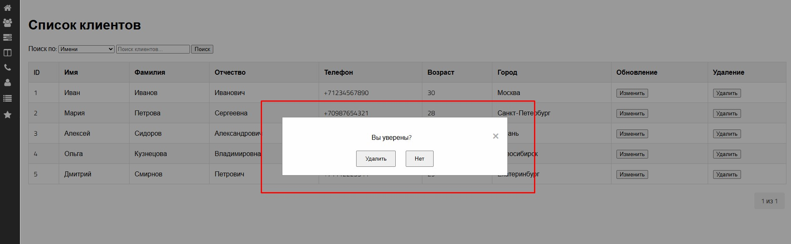

Для безопасности случайного удаления добавлено окно предупреждения об удалении

### Форма изменения
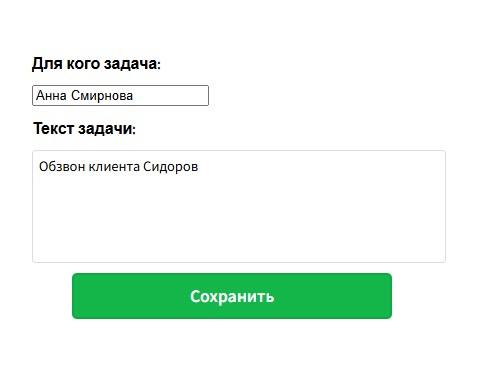

Форма изменения задачи, данные устанавливаются автоматически.

### Поиск
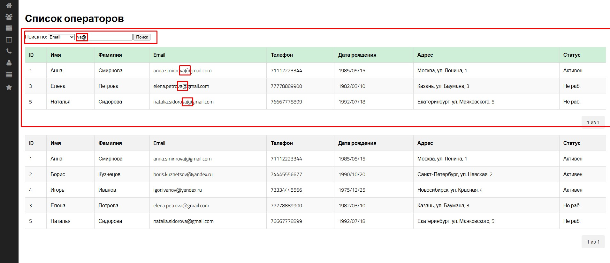

Поиск организован в каждом блоке приложения и по разным критериям.
Таблица найденных данных выделена зеленым цветом.

